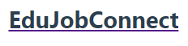

# EduJobConnect

EduJobConnect is a platform that bridges the gap between education and employment, offering tailored courses and connecting learners with job opportunities that match their skills.

## Table of Contents

- [Features](#features)
- [Usage](#usage)
- [Installation](#installation)
- [Contributing](#contributing)
- [License](#license)

## Features

- **Courses:** Explore a variety of courses including Web Development, Data Science, and Graphic Design.
- **Job Listings:** Find your dream job with job listings featuring positions like Software Engineer, Data Analyst, and Graphic Designer.
- **About EduJobConnect:** Learn about our mission to empower individuals through education and job connections.
- **Contact Us:** Easily get in touch with us via the contact form.

## Usage

To use EduJobConnect, simply navigate through the sections of the website using the provided links in the header or by scrolling down the page. Explore courses, find job listings, learn about us, and contact us using the provided form.

## Installation

As a web-based platform, there's no installation required to use EduJobConnect. Simply visit the website through your preferred web browser.

## Contributing

We welcome contributions to improve EduJobConnect! If you would like to contribute, please follow these guidelines:

1. Fork the repository.
2. Create a new branch for your feature or fix.
3. Make your changes.
4. Test your changes thoroughly.
5. Submit a pull request.

## License

This project is licensed under the [MIT License](LICENSE). Feel free to use, modify, and distribute this project according to the terms of the license.

---

Copyright © 2024 EduJobConnect. All Rights Reserved.

For more information, visit [EduJobConnect](https://placide11.github.io/EduJobConnect/).
